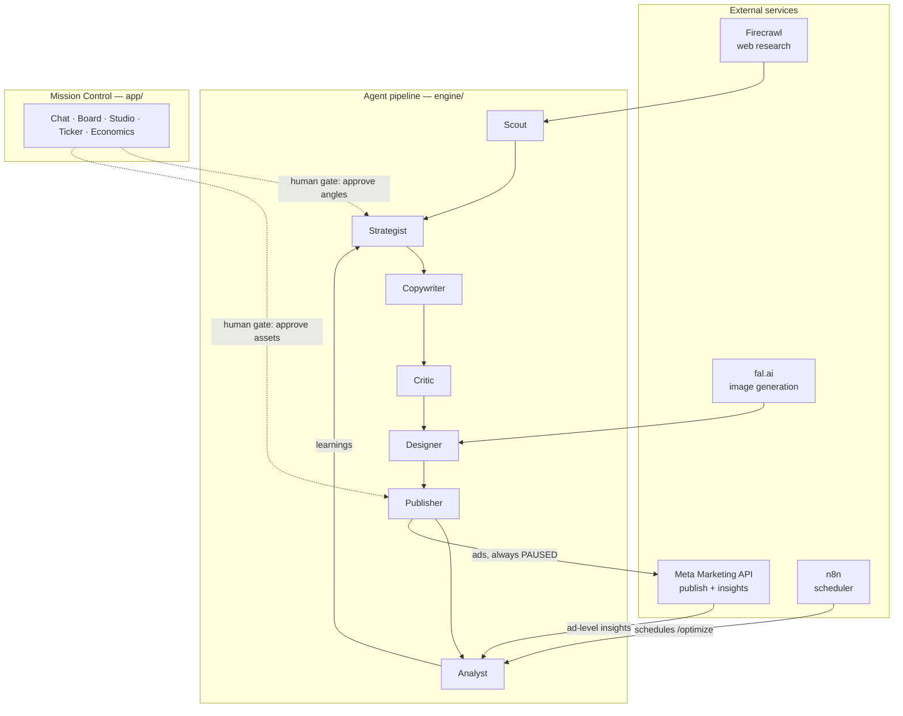

# adloop

**Open-source agentic paid-ads engine.** Point it at a brand URL: it researches the brand — including the outside view from the open web — formulates testable angle hypotheses, writes and critiques ad copy, generates static creatives, and publishes real Meta campaigns, always paused. A human reviews, approves, and deliberately flips the switch. The Analyst then mines ad-level insights so the next batch is built "more like the winners" — cost per result falls loop by loop.

> **The machine tests. The human decides.**

Live demo: **[adloop-app.onrender.com](https://adloop-app.onrender.com)**

Built at **Cursor Hackathon Stuttgart 2026** — in one day.

<!-- Screenshots: Mission Control board · Asset Studio · Economics — coming soon -->

## How it works

A seven-stage agent pipeline feeds a closed learning loop. Mission Control is the human's chat-first cockpit: every angle and every asset passes an explicit approval gate before anything reaches the ad account. Ads are always created paused — nothing goes live without a human deliberately activating it, in the interface or in Ads Manager.



| Stage | What it does |
|---|---|
| **Scout** | Turns a URL into a unified research doc: audience psychographics, awareness distribution, voice-of-customer language (Firecrawl search + scrape) |
| **Strategist** | Generates diverse angle hypotheses (segment × pain × mechanism × hook direction) — **human approves** |
| **Copywriter** | Outline first, then structured ad copy (hook / primary text / headline / CTA) |
| **Critic** | Separate agent scores every copy against a direct-response rubric and brand guardrails before rewrite |
| **Designer** | Generates static creatives from a brief plus brand design tokens (fal.ai, selectable model) |
| **Publisher** | Creates campaign, ad set, creatives, and ads via the Meta Marketing API — **every object PAUSED** |
| **Analyst** | Reads ad-level insights, classifies winners and losers, writes learnings back into the brand's evidence — optimizing for cost per lead, never clicks |

At runtime the loop is driven by n8n: a scheduled workflow triggers `/optimize` on an interval.

## Architecture

- **Chat-first Mission Control** (`app/`) — a Next.js UI with chat, an angle kanban board, an asset studio, a live run ticker, and an economics view. All human gates live here.
- **Agent pipeline** (`engine/agents/`) — one TypeScript orchestrator per stage: Scout → Strategist → Copywriter → Critic → Designer → Publisher → Analyst.
- **Skills as markdown** (`engine/skills/`) — the prompt knowledge (research questions, angle schema, copy rubric, critic rubric, mining rules) lives in versioned markdown modules, so the engine can update its own craft.
- **Brands as data** (`brands/`) — everything company-specific is private local data, never code.
- **JSON store** (`data/`) — simple file-backed persistence; long pipeline runs execute as in-process jobs, the UI polls state.
- **Human gates** — angle approval, asset approval, and ad activation are human decisions by design; the engine cannot skip them.

## Quickstart

```bash
git clone https://github.com/LinusAurel/adloop.git
cd adloop
pnpm install
cp .env.example .env   # fill in your API keys (sources are commented inline)
pnpm demo:load         # load the versioned demo brand into the store
pnpm dev
```

Open [http://localhost:3000](http://localhost:3000) for Mission Control.

### Deploy

A `Dockerfile` is included — deploy to anything that runs a persistent Node process (long pipeline runs execute in-process, so serverless timeouts will bite). Set the env vars from `.env.example` and put `ADLOOP_ADMIN_SECRET` in front of mutation routes for public deployments.

## Tech stack

- **Next.js 15** (App Router, TypeScript) — one app for UI and API routes
- **Anthropic API** — `claude-sonnet-5` as the default model, routing configurable per pipeline stage
- **Firecrawl** — search + scrape for brand research
- **fal.ai** — static creative generation with selectable image models
- **Meta Graph API v25** — campaign/ad-set/creative/ad creation and ad-level insights
- **n8n** — scheduled automation triggering the optimize loop

## Safety by design

adloop touches a real ad account, so the guardrails are structural, not optional:

- **Every publish starts PAUSED.** The server enforces `status: PAUSED` on every Meta object it creates (campaigns, ad sets, ads) and ignores any request value that says otherwise. Going live is a separate, deliberate human click — via the admin-guarded status route in the interface or directly in Ads Manager. No agent ever activates an ad, and no publish ever does.
- **Human approval gates.** Angles and assets must be explicitly approved in Mission Control before the pipeline continues, and activation itself is the final gate. No gate can be automated away.
- **No agent spend.** The daily budget is fixed by a human up front; no agent ever creates, changes, or manages budgets.
- **Admin secret on mutation routes.** In public deployments, publish/optimize/approve routes require an `x-admin-secret` header. Read routes stay open — that is the demo URL.

## A note on insights data

Freshly published ads are paused, and paused ads produce no performance data — physics, not a bug. The Analyst therefore demonstrates two things separately: a real insights read against the ad account (connectivity proof), and the pattern-mining loop running on a clearly labeled, realistic insights fixture. The fixture run is never presented as live optimization.

## Brands as data

Everything company-specific lives in `brands/<slug>/` as data — never as code in `engine/` or `app/`. A brand is a research doc, a target function (default target plus a per-campaign `CPL`/`CPA` target), guardrails, CTA texts, design tokens, and a winner library that grows with validated tests. Media-buying style is a configurable **playbook** (`engine/playbooks/`), not hard-coded engine behavior. Onboarding a new brand takes a URL and a product description; the engine researches the rest.

**`brands/` is a local, private directory.** Real brand data is never committed — the repo is public, so `.gitignore` excludes everything under `brands/` except `brands/_example/`, a fictional brand that documents the structure. To add a brand, copy `brands/_example/` to `brands/<slug>/` and fill in real data; it stays untracked automatically.

```
engine/     # generic, open source: agents, skills (markdown prompt modules), connectors, playbooks
brands/     # brand data layer — local and private; only brands/_example/ is committed
app/        # Next.js Mission Control UI + API routes
```

## Roadmap

- **ElevenLabs audio briefings** — turn the Analyst's findings into a spoken 30-second briefing (planned; the connector scaffold already exists)
- **Landing page generation** — generated LPs with strict ad→page message match, closing the creative loop end to end
- **More optimization goals** — purchase and traffic objectives alongside the current lead objective
- **Settings-based connector keys** — configure API keys per workspace in the UI instead of env vars

## License

[MIT](LICENSE) — © 2026 Linus Lüderitz
