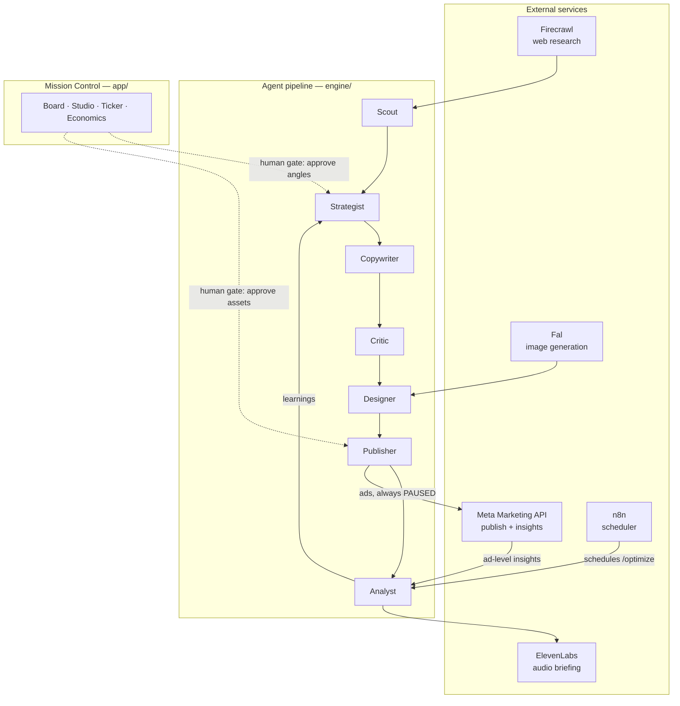

# adloop

**Open-source agentic ads engine.** It researches a brand, formulates testable angle hypotheses, generates concept-diverse ad creatives, publishes them to Meta as real ads (paused), and mines the account's performance data for patterns — so the next batch is built "more like the winners".

> **The machine tests. The human decides.**

Live demo: **[adloop-app.onrender.com](https://adloop-app.onrender.com)**

Built at **Cursor Hackathon Stuttgart 2026** — in one day.

## How it works

A seven-stage agent pipeline feeds a closed learning loop. Mission Control is the human's cockpit: every angle and every asset passes an explicit approval gate before anything reaches the ad account, and nothing goes live without a human flipping the switch in Ads Manager.



| Stage | What it does |
|---|---|
| **Scout** | Turns a URL into a unified research doc: audience psychographics, awareness distribution, voice-of-customer language (Firecrawl) |
| **Strategist** | Generates diverse angle hypotheses (segment × pain × mechanism × hook direction) — **human approves** |
| **Copywriter** | Outline first, then structured ad copy (hook / primary text / headline / CTA) |
| **Critic** | Separate agent scores every copy against a direct-response rubric and brand guardrails before rewrite |
| **Designer** | Generates static creatives from a brief plus brand design tokens (Fal) |
| **Publisher** | Creates campaign, ad set, creatives, and ads via the Meta Marketing API — **every object PAUSED** |
| **Analyst** | Reads ad-level insights, classifies winners and losers, writes learnings back into the brand's evidence — optimizing for cost per lead, never clicks |

The loop is orchestrated by coding agents at build time and by n8n at runtime (a scheduled workflow triggers `/optimize`). ElevenLabs turns the Analyst's findings into a 30-second audio briefing.

## Quickstart

```bash
git clone https://github.com/LinusAurel/adloop.git
cd adloop
pnpm install
cp .env.example .env   # fill in your API keys (sources are commented inline)
pnpm dev
```

Open [http://localhost:3000](http://localhost:3000) for Mission Control.

## Safety by design

adloop touches a real ad account, so the guardrails are structural, not optional:

- **Every publish is PAUSED.** The server enforces `status: PAUSED` on all Meta objects (campaigns, ad sets, ads) and ignores any request value that says otherwise. Activation happens exclusively by a human in Ads Manager.
- **Human approval gates.** Angles and assets must be explicitly approved in Mission Control before the pipeline continues. No gate can be automated away.
- **No agent spend.** The daily budget is fixed by a human up front; no agent ever creates, changes, or manages budgets.
- **Admin secret on mutation routes.** In public deployments, publish/optimize/approve routes require an `x-admin-secret` header. Read routes stay open — that is the demo URL.

## Honest demo note

Freshly published ads are paused, and paused ads produce no performance data — physics, not a bug. The Analyst therefore demonstrates two things separately: a real insights read against the ad account (connectivity proof), and the pattern-mining loop running on a clearly labeled, realistic insights fixture. We do not present the fixture run as live optimization.

## Brands as data

Everything company-specific lives in `brands/<slug>/` as data — never as code in `engine/` or `app/`. A brand is a research doc, a target function, guardrails, design tokens, and a winner library that grows with validated tests. Media-buying style is a configurable **playbook** (`engine/playbooks/`), not hard-coded engine behavior. Onboarding a new brand takes a URL and a product description; the engine researches the rest.

```
engine/     # generic, open source: agents, skills (markdown prompt modules), connectors, playbooks
brands/     # brand data layer — one folder per brand
app/        # Next.js Mission Control UI + API routes
```

## License

[MIT](LICENSE) — © 2026 Linus Lüderitz
